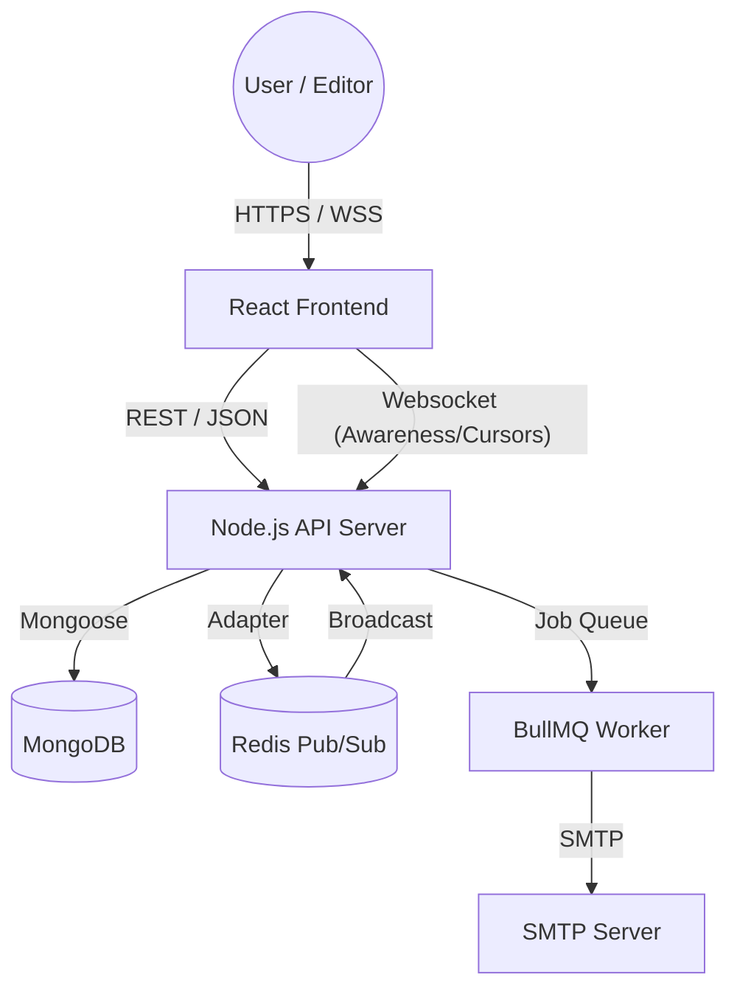

# 🏗️ System Architecture: Real-Time Collaboration Platform

This document outlines the technical architecture of the LogicVeda Real-Time Collaboration Platform (v2.0).

## 1. High-Level Architecture (C4 Model)

The platform follows a modern Monorepo structure, separating the concerns of the **Client (React)**, **Server (Node/Express)**, and **Shared Types**.

## 2. Real-Time Synchronization (CRDT)

We utilize **Yjs** for Conflict-free Replicated Data Types (CRDT). This ensures that even with hundreds of concurrent editors, there is zero character loss and no merge conflicts.

- **Frontend**: Tiptap Editor + `y-prosemirror` + `yjs`.
- **Backend**: Custom Socket.io bridge that broadcasts `Uint8Array` updates.
- **Awareness**: Cursors and presence information are shared via a non-persistent awareness bridge.

## 3. Distributed Scaling (Redis)

To support enterprise-grade concurrency, the Socket.io server uses the **Redis Adapter**. This allows multiple server instances to communicate and sync document updates across different nodes.

## 4. Notification Engine (BullMQ)

Notifications (Comments, Invitations) are processed asynchronously to ensure <200ms API response times.

- **Publisher**: Express controllers add jobs to the `notifications` queue.
- **Consumer**: A dedicated BullMQ worker processes jobs, sends emails via Nodemailer, and emits real-time socket events.

## 5. Security & RBAC

- **JWT**: Dual-token system (15m Access, 7d Refresh) with rotation.
- **RBAC**: Strict permission checks (Owner > Editor > Commenter > Viewer) enforced at the middleware and controller level.
- **OWASP**: Implementation of `helmet`, `express-rate-limit`, and data sanitization.

---
*Prepared by Naveen Kota - lv1-2026-03-01*
